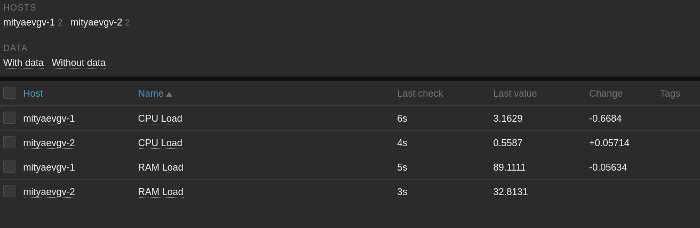

# hw-9-04_mon_prometheus1
HW-9-04_Система мониторинга Prometheus. Часть 1

# Домашнее задание к занятию «Система мониторинга Prometheus. Часть 1»

### Задание 1

Установите Prometheus.

#### Процесс выполнения

2. Создадим пользователя **prometheus**:
`su -
 useradd --no-create-home --shell /bin/false prometheus`

4. Создал item **CPU Load** (`system.cpu.util[all,system]`).
5. Создал item **RAM Load** (`vm.memory.size[pused]`).

<kbd></kbd>

<kbd></kbd>

---

### Задание 2

Добавьте в Zabbix два хоста и задайте им имена <фамилия и инициалы-1> и <фамилия и инициалы-2>. Например: ivanovii-1 и ivanovii-2.

#### Процесс выполнения

5. Прикрепил к хостам **mityaevgv-1** и **mityaevgv-2** шаблон **Linux by Zabbix agent**:

<kbd></kbd>

6. Проверил раздел **Monitoring** -> **Latest data**:

<kbd></kbd>

<kbd></kbd>

---

### Задание 3

Привяжите созданный шаблон к двум хостам. Также привяжите к обоим хостам шаблон Linux by Zabbix Agent.

#### Процесс выполнения
2. Дополнительно прикрепил шаблон **Assignment 1** к каждому хосту:

<kbd></kbd>

3. Проверил раздел **Monitoring** -> **Latest data** с учетом внесенных изменений:

<kbd></kbd>

---

### Задание 4

Создайте свой кастомный дашборд.

#### Процесс выполнения
2. Создал новый дэшборд **Assignment 4**.
3. Разместил на дэшборде 4 графика: **CPU Utilisation**, **Available RAM**, **Load Average (15m)** и **Disk Space (in use)**.

<kbd></kbd>

<kbd></kbd>

<kbd></kbd>

---

