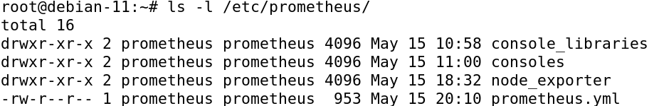
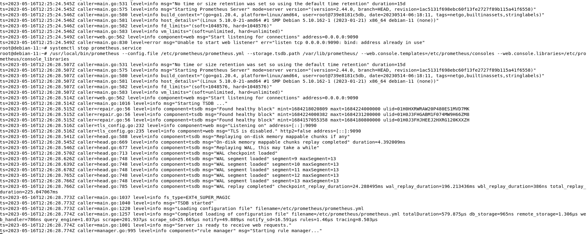
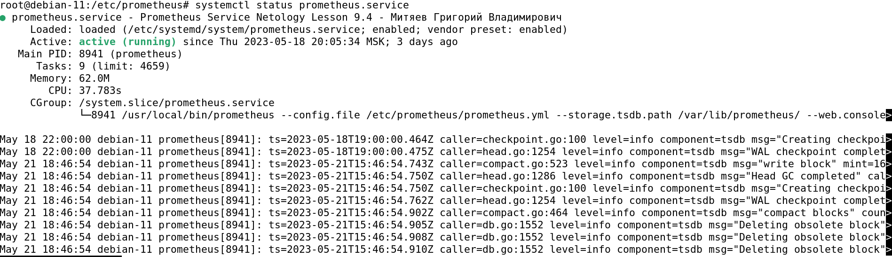
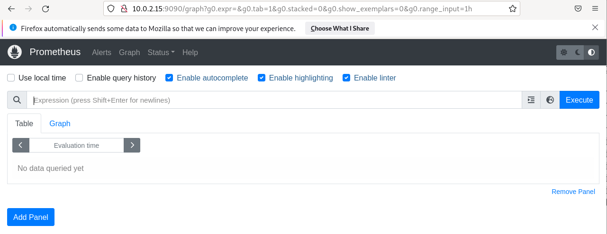
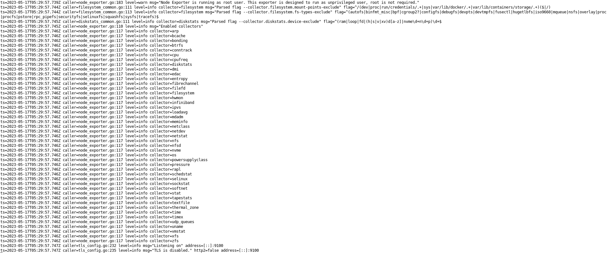
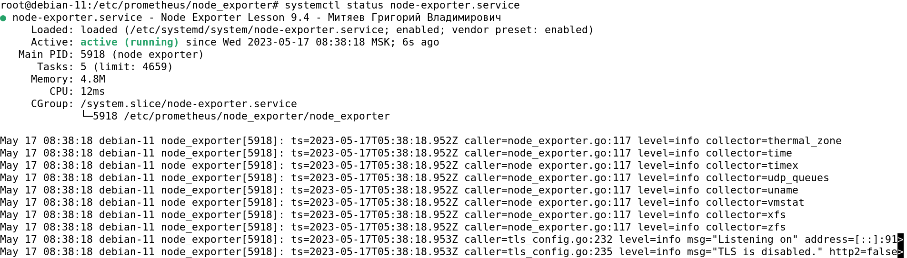
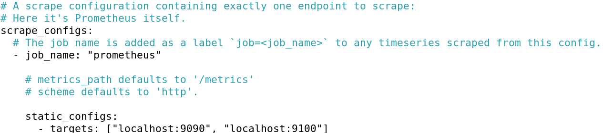
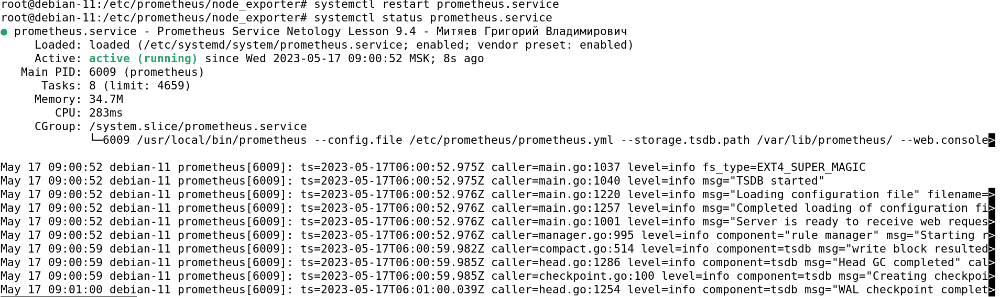
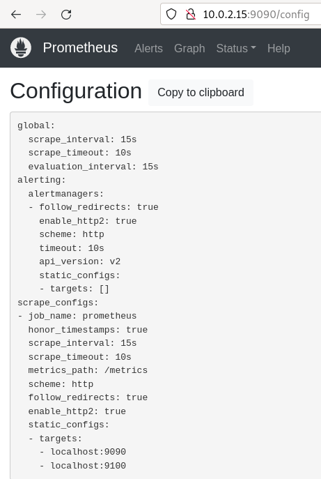
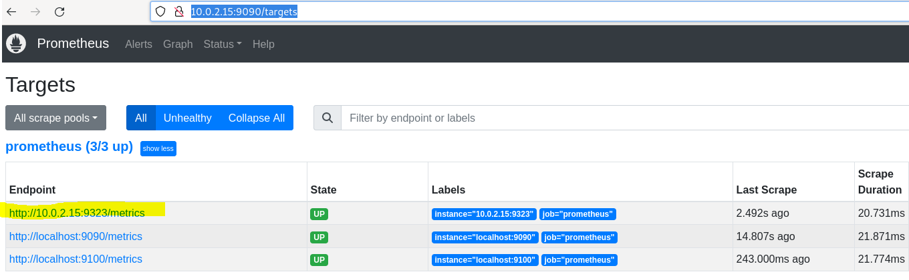

# hw-9-04_mon_prometheus1
HW-9-04_Система мониторинга Prometheus. Часть 1

# Домашнее задание к занятию «Система мониторинга Prometheus. Часть 1»

### Задание 1

Установите Prometheus.

#### Процесс выполнения

2. Создадим пользователя **prometheus**:
```
su -
```
```
useradd --no-create-home --shell /bin/false prometheus
```
3. Скачивание **Prometheus 2.44.0** из официального репозитория: 
```
wget https://github.com/prometheus/prometheus/releases/download/v2.44.0/prometheus-2.44.0.linux-amd64.tar.gz
```
Распаковываем файлы из архива **prometheus-2.44.0.linux-amd64.tar.tz** и переходим в созданную директорию:
```
tar xvfz prometheus-2.44.0.linux-amd64.tar.tz
cd prometheus-2.44.0.linux-amd64.tar.tz/
```
Создадим директории, необходимые для работы **Prometheus**:
```
mkdir /etc/prometheus/
mkdir /var/lib/prometheus
```
Скопируем утилиты **prometheus** и **promtool** в директорию **/usr/local/bin**:
```
cp ./prometheus promtool /usr/local/bin
```
Скопируем директорию **console_libraries** в **/etc/prometheus**:
```
cp -R ./console_libraries /etc/prometheus
```
Скопируем директорию **consoles** в **/etc/prometheus**:
```
cp -R ./consoles /etc/prometheus
```
Скопируем файл конфигурации **prometheus.yml** в **/etc/prometheus**:
```
cp ./prometheus.yml /etc/prometheus
```
Проверим содержимое директории **/etc/prometheus**:

<kbd></kbd>

Все необходимые на данном этапе объекты: **console_libraries** (директория), **consoles** (директория)
и **prometheus.yml** (конфиг-файл) находятся на месте.

Передадим пользователю **prometheus** права ко всех необходимым объектам:
```
chown -R prometheus:prometheus /etc/prometheus 
chown -R prometheus:prometheus /var/lib/prometheus
```
Передадим права на утилиты **prometheus** и **promtool** в директории **/usr/local/bin** пользователю
**prometheus**:
```
chown prometheus:prometheus /usr/local/bin/prometheus
chown prometheus:prometheus /usr/local/bin/promtool
```
Чтобы проверить, правильно ли мы разместили все компоненты **Prometheus**, нужно попробовать их запустить:
```
/usr/local/bin/prometheus \
--config.file /etc/prometheus/prometheus.yml \
--storage.tsdb.path /var/lib/prometheus/ \
--web.console.templates=/etc/prometheus/consoles \
--web.console.libraries=/etc/prometheus/console_libraries
```
<kbd></kbd>

4. Для настройки систему на запуск **Prometheus** самостоятельно создадим сервис **prometheus.service**:

```
nano /etc/systemd/system/prometheus.service
```
```
[Unit]
Description=Prometheus Service Netology Lesson 9.4 - Митяев Григорий Владимирович
After=network.target
[Service]
User=prometheus
Group=prometheus
Type=simple
ExecStart=/usr/local/bin/prometheus \
--config.file /etc/prometheus/prometheus.yml \
--storage.tsdb.path /var/lib/prometheus/ \
--web.console.templates=/etc/prometheus/consoles \
--web.console.libraries=/etc/prometheus/console_libraries
ExecReload=/bin/kill -HUP $MAINPID Restart=on-failure
[Install]
WantedBy=multi-user.target
```
5. Включим автозапуск сервиса **prometheus.service**:
```
systemctl enable prometheus.service
```
Запустим сервис **prometheus.service**:
```
systemctl start prometheus.service
```
Проверим статус работы сервиса:
```
systemctl status prometheus.service
```
<kbd></kbd>

Попробуем сделать перезапуск сервиса **prometheus.service**:
```
systemctl restart prometheus.service
```
Оставновка сервиса **prometheus.service**:
```
systemctl stop prometheus.service
```
Веб-интерфейс **Prometheus** доступный по адресу `http://10.0.2.15:9090`:

<kbd></kbd>

---

### Задание 2

Установите Node Exporter.

#### Процесс выполнения

2. Скачаем **Node Exporter 1.5.0** из официального репозитория:

```
cd
wget https://github.com/prometheus/node_exporter/releases/download/v1.5.0/node_exporter-1.5.0.linux-amd64.tar.gz
```
Распакуем архив **node_exporter-1.5.0.linux-amd64.tar.gz**:
```
tar xvfz node_exporter-1.5.0.linux-amd64.tar.gz
```
Переходим в созданную директорию:
```
cd node_exporter-1.5.0.linux-amd64.tar.gz
```
Создадим директорию **/etc/prometheus/node-exporter** и скопируем туда файл **node_exporter**:
```
mkdir /etc/prometheus/node-exporter
cp ./node_exporter /etc/prometheus/node-exporter/
```
Передадим права файл **node_exporter** нашему пользователю **prometheus**:
```
chown prometheus:prometheus /etc/prometheus/node-exporter/node_exporter
```
Проверим работоспособность **node_exporter**:

<kbd></kbd>

3. Создадим сервис **node-exporter.service** для автоматического запуска утилиты:
```
nano /etc/systemd/system/node-exporter.service
```
```
[Unit]
Description=Node Exporter Lesson 9.4
After=network.target
[Service]
User=prometheus
Group=prometheus
Type=simple
ExecStart=/etc/prometheus/node_exporter/node_exporter
[Install]
WantedBy=multi-user.target
```
Включим автозапуск сервиса:
```
systemctl enable node-exporter.service
```
Запустим новый сервис и проверим его статус:
```
systemctl start node-exporter.service
systemctl status node-exporter.service
```
<kbd></kbd>

---

### Задание 3

Подключите Node Exporter к серверу Prometheus.

#### Процесс выполнения
2. Добавление нашего end-point, чтобы **Prometheus** начал опрашивать с него данные:
```
cd
nano /etc/prometheus/prometheus.yml
```
Найдем раздел **scrape_configs** и добавим в него информацию о порте, на котором работает **node_exporter**
- **localhost:9100**:

```
static_configs:
  -targets ["localhost:9090", "localhost:9100"]
```
<kbd></kbd>

Перезапустим сервис **prometheus.service**:
```
systemctl restart prometheus.service
```
Проверим статус работы сервиса:
```
systemctl status prometheus.service
```
<kbd></kbd>

Скриншот раздела Prometheus **Status** -> **Configuration**:

<kbd></kbd>

Скриншот раздела Prometheus **Status** -> **Targets**:

<kbd></kbd>
