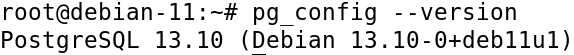
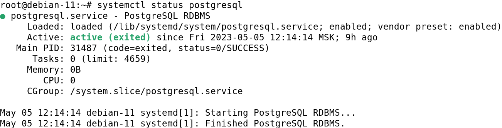
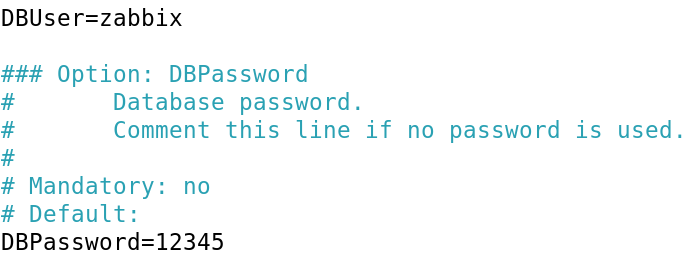
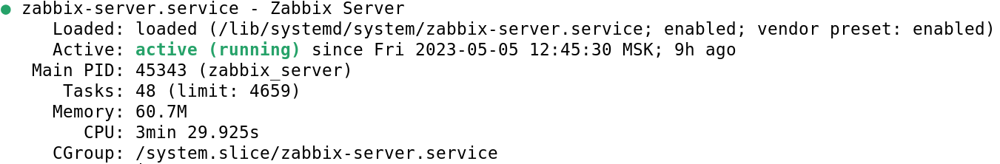
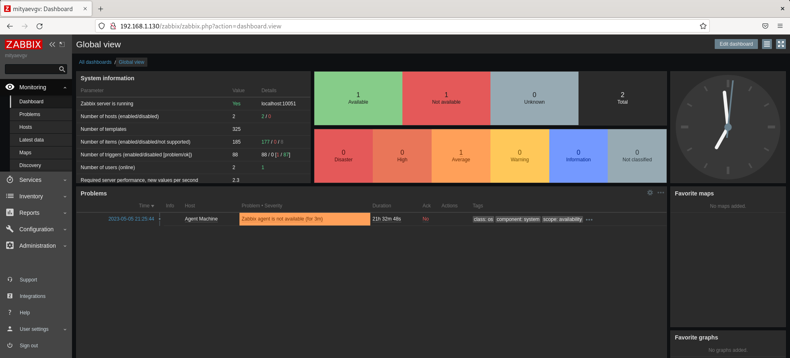
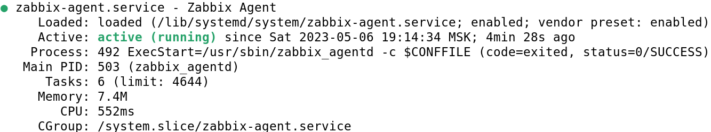
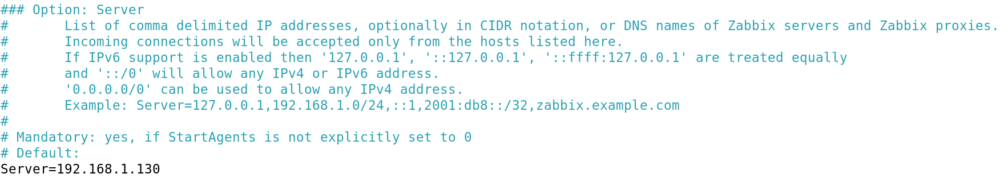
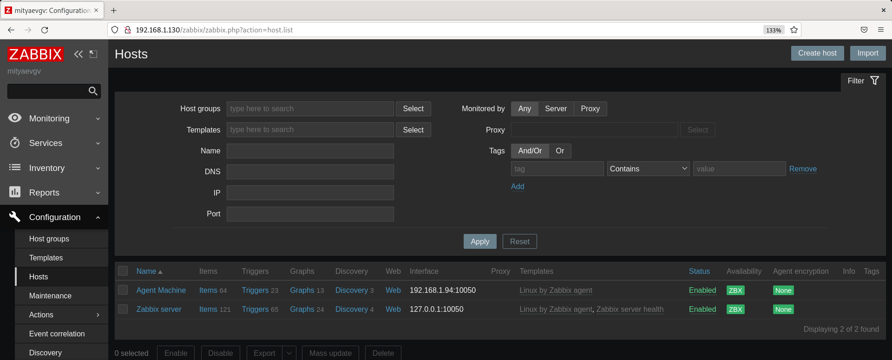
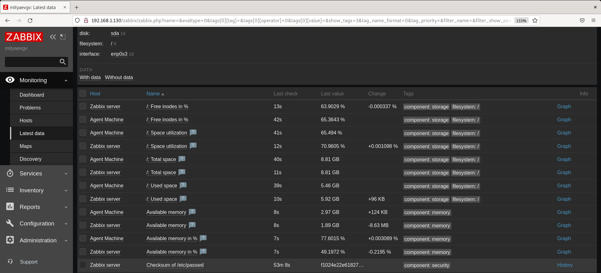

# hw-03_mon_zabbix2
HW-03_Система мониторинга Zabbix. Часть 2

# Домашнее задание к занятию «Система мониторинга Zabbix. Часть 2»

### Цели задания
1. Научитьcя создавать свои шаблоны в Zabbix, добавлять в Zabbix хосты и связывать шаблон с хостами.
2. Научиться составлять кастомный дашборд.
3. Научиться создавать UserParameter на Bash.
4. Научиться создавать Python-скрип, добавляться в него UserParameter и прикреплять к шаблону.
5. Научиться создавать Vagrant-скрипты для Zabbix Agent.

### Задание 1

Установите Zabbix Server с веб-интерфейсом.

#### Процесс выполнения
1. Просмотрел записи лекций из урока.
2. Установил **PostgreSQL** из системного репозитория **Debian 11**.
3-4. Установка **Zabbix сервера** и **Zabbix веб-интерфейса** c помощью [конфигуратора команд] (https://www.zabbix.com/ru/download?zabbix=6.0&os_distribution=debian&os_version=11&components=server_frontend_agent&db=pgsql&ws=apache). Без установки Zabbix агента.

```
sudo apt install postgresql
sudo systemctl start postgresql
sudo systemctl enable postgresql
sudo systemctl status postgresql
pg_config --version

wget https://repo.zabbix.com/zabbix/6.0/debian/pool/main/z/zabbix-release/zabbix-release_6.0-4+debian11_all.deb
dpkg -i zabbix-release_6.0-4+debian11_all.deb
apt update

apt install zabbix-server-pgsql zabbix-frontend-php php7.4-pgsql zabbix-apache-conf zabbix-sql-scripts

sudo -u postgres createuser --pwprompt zabbix
sudo -u postgres createdb -O zabbix zabbix

zcat /usr/share/zabbix-sql-scripts/postgresql/server.sql.gz | sudo -u zabbix psql zabbix

nano /etc/zabbix/zabbix_server.conf
DBPassword=12345

systemctl restart zabbix-server apache2
systemctl enable zabbix-server apache2
systemctl status zabbix-server.service
systemctl status apache2.service

```

<kbd></kbd>

<kbd></kbd>

<kbd></kbd>

<kbd></kbd>

<kbd></kbd>

<kbd></kbd>

---

### Задание 2

Установите Zabbix Agent на два хоста.


#### Процесс выполнения

2. Установка **Zabbix агента** на 2 ВМ: **192.168.1.130** (та же машина, на которой размещен Zabbix сервер) и **192.168.1.94**.
3. Добавил адрес **Zabbix сервера** - **192.168.1.130** в список разрешенных хостов на ВМ - **192.168.1.94** в файле конфигурации
Zabbix агента - **zabbix_agentd.conf**, расположенный в **/etc/zabbix/zabbix_agentd.conf**.
4. Добавил **Zabbix агентов** в раздел **Configuration** -> **Hosts** Zabbix сервера.

```
wget https://repo.zabbix.com/zabbix/6.0/debian/pool/main/z/zabbix-release/zabbix-release_6.0-4+debian11_all.deb
dpkg -i zabbix-release_6.0-4+debian11_all.deb

apt update

apt install zabbix-agent

systemctl restart zabbix-agent
systemctl enable zabbix-agent
systemctl status zabbix-agent.service

nano /etc/zabbix/zabbix_agentd.conf
systemctl restart zabbix-agent.service
systemctl status zabbix-agent.service

```

<kbd></kbd>

<kbd></kbd>

<kbd></kbd>

<kbd></kbd>
