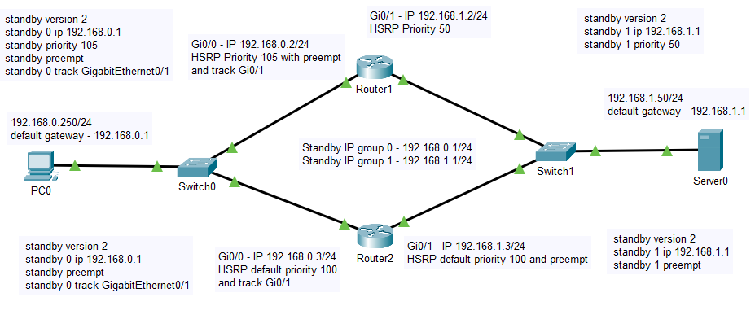
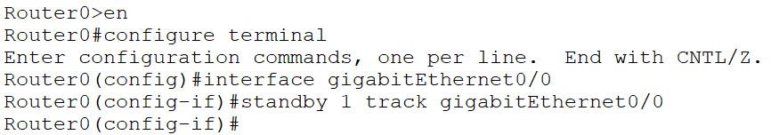
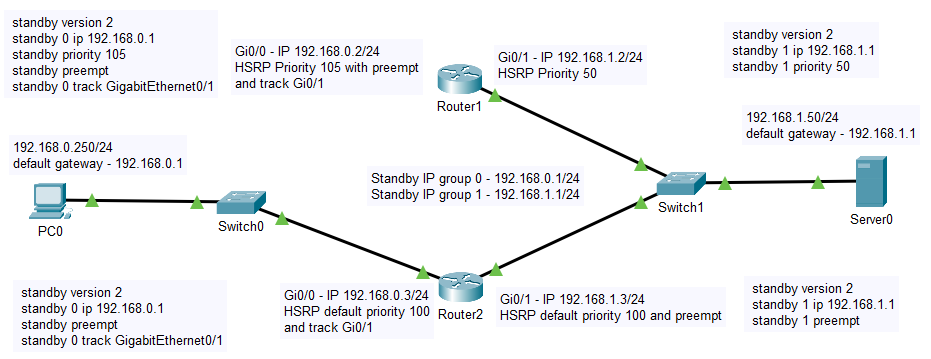
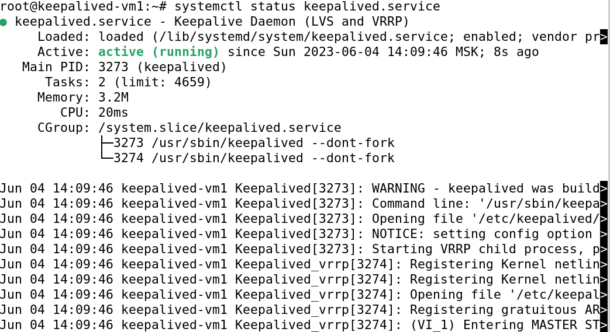
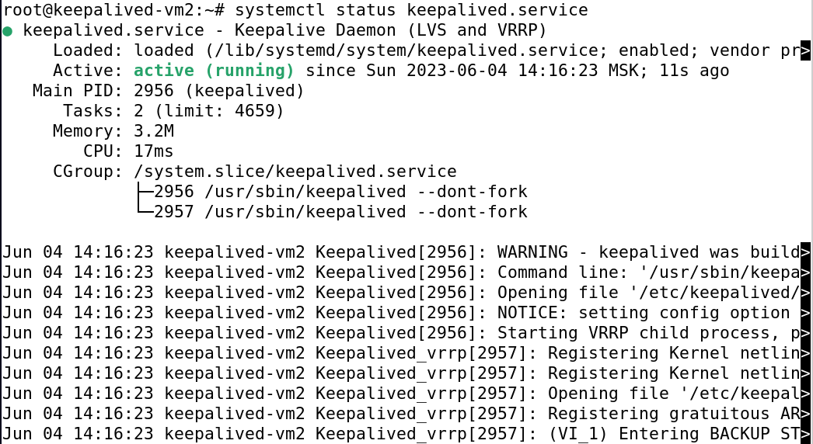

# hw_10-1_dr_keepalived
HW_10-1_Disaster Recovery и Keepalived

# Домашнее задание к занятию 1 «Disaster Recovery и Keepalived»

### Задание 1

Схема сети из лекции:

<kbd></kbd>

Настройка отслеживания состояния интерфейсов **GigabitEthernet0/0** для маршрутизаторов 
**Router1(0)** и **Router2(1)** для группы **Grp 1**:

```
Router0>en
Router0#configure terminal
Enter configuration commands, one per line.  End with CNTL/Z.
Router0(config)#interface gigabitEthernet0/0
Router0(config-if)#standby 1 track gigabitEthernet0/0
```
<kbd></kbd>

```
Router1>en
Router1#conf t
Enter configuration commands, one per line.  End with CNTL/Z.
Router1(config)#int gi0/0
Router1(config-if)#standby 1 track gi0/0
```
<kbd></kbd>

Для проверки работы функции отслеживания состояния интерфейсов разорвем канал связи между
**Switch0** и **Router1**:

<kbd></kbd>

При запуске **ping** между **PC0** и **Server0** в режиме **Simulation** трафик возвращается 
по нижней магистрали. Файл **hsrp_advanced.pkt** приложен к ДЗ.

---

### Задание 2

Запустим 2 виртуальные машины - **keepalived-vm1** и **keepalived-vm2** для выполнения задания.

Проверим их **IP-адреса**:
```
root@keepalived-vm1:~# ip a
192.168.1.127
root@keepalived-vm2:~# ip a
192.168.1.110
```
Установим сервис **Keepalived** на каждой виртуальной машине:
```
root@keepalived-vm1:~# apt install keepalived
root@keepalived-vm2:~# apt install keepalived
```
Создадим конфиг-файл **/etc/keepalived/keepalived.conf** на **keepalived-vm1**:
```
root@keepalived-vm1:~# nano /etc/keepalived/keepalived.conf
```
```
vrrp_instance VI_1 {
        state MASTER
        interface enp0s3
        virtual_router_id 15
        priority 255
        advert_int 1

        virtual_ipaddress {
              192.168.1.15/24
        }

}
```
Создадим конфиг-файл **/etc/keepalived/keepalived.conf** на **keepalived-vm2**:
```
root@keepalived-vm2:~# nano /etc/keepalived/keepalived.conf
```
```
vrrp_instance VI_1 {
        state BACKUP
        interface enp0s3
        virtual_router_id 15
        priority 200
        advert_int 1

        virtual_ipaddress {
              192.168.1.15/24
        }

}
```
Включим автозагрузку сервиса **keepalived.service**:
```
root@keepalived-vm1:~# systemctl enable keepalived.service
root@keepalived-vm2:~# systemctl enable keepalived.service
```
Запустим сервис **keepalived.service** на виртуальных машинах и проверим его статус:
```
root@keepalived-vm1:~# systemctl start keepalived.service
root@keepalived-vm1:~# systemctl status keepalived.service

root@keepalived-vm2:~# systemctl start keepalived.service
root@keepalived-vm2:~# systemctl status keepalived.service

```
<kbd></kbd>
<kbd></kbd>
```
Проверяем сетевые настройки на **keepalived-vm1**:
```
ip a
```
Виртуальной машине был назначен дополнительный IP-адрес - **192.168.1.15** (floating IP, который
назначил сервис **Keepalived**):
```
inet 192.168.1.15/24 scope global secondary enp0s3
```
Проверяем сетевые настройки на **keepalived-vm2**:
```
ip a
inet 192.168.1.110/24
```
Здесь пока остался 1 IP-адрес - **192.168.1.110**.

На виртуальной машине **keepalived-vm1** остановим сервис **keepalived.service**:
```
root@keepalived-vm1:~# systemctl stop keepalived.service
```
Теперь у виртуальной машины **keepalived_vm1** нет плавающего IP-адреса, а виртуальной машине
**keepalived-vm2** был назначен floating IP - **192.168.1.15**, т.е. машина из режима BACKUP
перешла в режим MASTER.

Установим сервер **nginx** на виртуальные машины **keepalived-vm1** и **keepalived-vm2**:
```
apt install nginx
```
Изменим страницу **Nginx** по умолчанию, чтобы было понятно, к какому именно из серверов мы
получаем доступ:
```
nano /var/www/html/index.nginx-debian.html
```
В строку приветствия добавим IP-адреса наших виртуальных машин:
```
<h1>Welcome to 192.168.1.127!</h1>
<h1>Welcome to 192.168.1.110!</h1>
```

Bash-скрипт для проверки состояния сетевого порта **80**, на котором работает **Nginx-сервер**, и 
доступности **index.html** в расположении **/var/www/html/index.nginx-debian.html**:
```
if [[ $(netstat -tulpn | grep LISTEN | grep :80) ]] && [[ -f /var/www/html/index.nginx-debian.html ]]; then
exit 0
else
exit 1
fi
```
