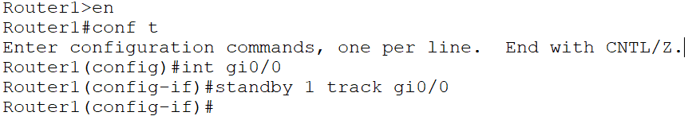

# hw_10-1_dr_keepalived
HW_10-1_Disaster Recovery и Keepalived

# Домашнее задание к занятию 1 «Disaster Recovery и Keepalived»

### Задание 1

Схема сети из лекции:

<kbd></kbd>

Настройка отслеживания состояния интерфейсов **GigabitEthernet0/0** для маршрутизаторов 
**Router1(0)** и **Router2(1)** для группы **Grp 1**:

```
Router0>en
Router0#configure terminal
Enter configuration commands, one per line.  End with CNTL/Z.
Router0(config)#interface gigabitEthernet0/0
Router0(config-if)#standby 1 track gigabitEthernet0/0
```
<kbd></kbd>

```
Router1>en
Router1#conf t
Enter configuration commands, one per line.  End with CNTL/Z.
Router1(config)#int gi0/0
Router1(config-if)#standby 1 track gi0/0
```
<kbd></kbd>

Для проверки работы функции отслеживания состояния интерфейсов разорвем канал связи между
**Switch0** и **Router1**:

<kbd></kbd>

При запуске **ping** между **PC0** и **Server0** в режиме **Simulation** трафик возвращается 
по нижней магистрали. Файл **hsrp_advanced.pkt** приложен к ДЗ.

---

### Задание 2

Установите Alertmanager и интегрируйте его с Prometheus.

#### Процесс выполнения

Скачаем последнюю версию **Alertmanager 0.25.0** из GitHub:
```
wget https://github.com/prometheus/alertmanager/releases/alertmanager-0.25.0.linux-and64.tar.tz
```
Распакуем скачанный архив:
```
tar xvfz alertmanager-0.25.0.linux-and64.tar.tz
```
Скопируем содержимое получившейся директории в определенные расположения на нашем хосте и предоставим
необходимые права доступа пользователю **prometheus**:
```
cd alertmanager-0.25.0.linux-and64.tar.tz
cp ./alertmanager /usr/local/bin/alertmanager
chown prometheus:prometheus /usr/local/bin/alertmanager
cp ./amtool /usr/local/bin/amtool
chown prometheus:prometheus /usr/local/bin/amtool
cp ./alertmanager.yml /etc/prometheus/alertmanager.yml
chown prometheus:prometheus /etc/prometheus/alertmanager.yml
```
Создадим сервис **prometheus-alertmanager.service**:
```
nano /etc/systemd/system/prometheus-alertmanager.service
```
```
[Unit]
Description=Alertmanager Service
After=network.target
[Service]
EnvironmentFile=-/etc/default/alertmanager
User=prometheus
Group=prometheus
Type=simple
ExecStart=/usr/local/bin/alertmanager \
--config.file=/etc/prometheus/alertmanager.yml \
--storage.path=/var/lib/prometheus/alertmanager $ARGS
ExecReload=/bin/kill -HUP $MAINPID
Restart=on-failure
[Install]
WantedBy=multi-user.target
```
Запустим сервис **prometheus-alertmanager.service**:
```
systemctl enable prometheus-alertmanager.service
systemctl start prometheus-alertmanager.service
systemctl status prometheus-alertmanager.service
```
Проверка статуса работы сервиса **prometheus-alertmanager.service**:

<kbd></kbd>

Настройка **Prometheus** на работу c **Alertmanager**:
```
nano /etc/prometheus/prometheus.yml
```
Находим раздел **#Alertmanager configuration**, раскомментируем строку ```# - alertmanager:9093``` и
заменим на ```- localhost: 9093```:

```
# Alertmanager configuration
alerting:
  alertmanagers:
    - static_configs:
        - targets:
            - localhost:9093
```
<kbd></kbd>

Перезапустим **prometheus.service** и проверим статус работы сервиса:
```
systemctl restart prometheus.service
systemctl status prometheus.service
```
<kbd></kbd>

Скриншот из веб-интерфейса **Prometheus**, показывающий состояние правила оповещения **InstanceDown**, 
- **FIRING**:

<kbd></kbd>

Скриншот из веб-интерфейса **Alertmanager**:

<kbd></kbd>

---

### Задание 3

Активируйте экспортёр метрик в Docker и подключите его к Prometheus.

#### Процесс выполнения

1. Установка **docker engine** согласно инструкции приведенной на официальном сайте **Docker**:
```
sudo apt update
sudo apt install ca-certificates curl gnupg

sudo install -m 0755 -d /etc/apt/keyrings
curl -fsSL https://download.docker.com/linux/debian/gpg | sudo gpg --dearmor -o /etc/apt/keyrings/docker.gpg
sudo chmod a+r /etc/apt/keyrings/docker.gpg

echo \
"deb [arch="$(dpkg --print-architecture)" signed-by=/etc/apt/keyrings/docker.gpg] https://download.docker.com/linux/debian \
"$(. /etc/os-release && echo "$VERSION_CODENAME")" stable" | \
sudo tee /etc/apt/sources.list.d/docker.list > /dev/null

sudo apt update

sudo apt install docker-ce docker-ce-cli containerd.io docker-buildx-plugin docker-compose-plugin

docker -v

sudo docker run hello-world
```
<kbd></kbd>

<kbd></kbd>

Включим автозапуск **docker.service**:
```
systemctl enable docker.service
```
Запустим **docker.service** и проверим его статус:
```
systemctl start docker.service
systemctl status docker.service
```
2. Для того, чтобы активировать экспортер метрик в **Docker** (заранее заложенный туда функционал
мониторига с помощью **Prometheus**), необходимо создать override-файл **daemon.json** для изменения
стандартных параметров, с помощью которых запускается **Docker**:
```
nano /etc/docker/daemon.json
```
```
{
 "metrics-addr": "0.0.0.0:9323",
 "experimental": true
}
```
3. Перезапустим **docker.service** и проверим его статус:
```
systemctl restart docker.service
systemctl status docker.service
```
4. Подключаемся к эндпоинту **http://10.0.2.15:9323/metrics** и видим список различных метрик,
которые выводим сам о себе **Docker**:

<kbd></kbd>

5. Добавим эндпоинт в конфиг **Prometheus**:
```
nano /etc/prometheus/prometheus.yml
```
В разделе **static_configs:** добавим новый **target** - **"10.0.2.15:9323"**:

<kbd></kbd>

Перезапустим **prometheus.service**:
```
systemctl restart prometheus.service
```
6. Проверим статус добавленного endpoint в веб-интерфейсе **Prometheus** - **http://10.0.2.15:9090/targets**:

<kbd></kbd>


